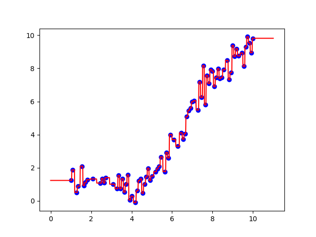

# MachineLearning
Learning Machine Learning

To someone unfamiliar with the topic, Machine Learning sounds like a course meant for humans to learn about machines. 
Its the opposite.

What i have experimented with so far:

Supervised Learning: Supervised learning occurs when you feed your model with training data first. Then run
run the model on new inputs to predict their outputs.

    Linear Regression
  
    Logistic Regression
  
    K-Nearest Neighbors
        
        K-Nearest Neighbors is an algorithm that (for a 1 dimensional dataset) observes the k closest x values from x* and averages their corresponding y values to predict a new y vlaue for x*.
        
   
   Here you can see when k=1 and we create 100 linspace x values, we overfit the model by alot.
   
   
   Here, with k=5, we seem to get a good graph and estimate of the underlying function that we are trying to predict.
   It seems like a sin functions. (it is.)
   
   
   This is where things break down. k=50. We only have a training dataset of 100ish points.
         
    Neural Networks
  
  
Unsupervised Learning:

    K-Means Clustering
  
    Principle Component Analysis
  

